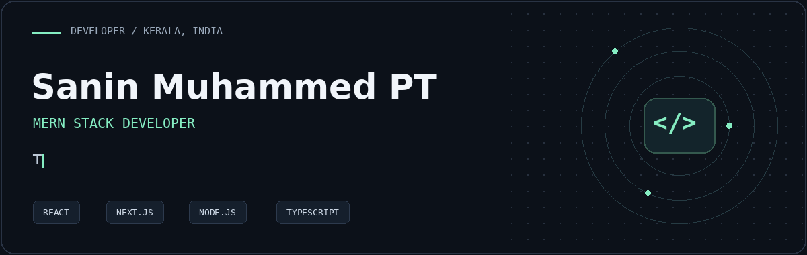

  

  
  &nbsp;
  
  &nbsp;
  

## About me

I'm **Sanin**, a MERN Stack Developer based in **Malappuram, Kerala**. I build web applications and admin dashboards with React, Next.js, Node.js, and MongoDB — with a focus on clean interfaces, reusable components, and reliable API integration.

My work spans **B2B marketplaces, tournament management, e-commerce, and travel management**. I enjoy turning complex workflows into interfaces that are easy to use and maintain.

- **Frontend:** responsive interfaces, multi-portal applications, dashboards, and role-based workflows.
- **Full stack:** REST APIs, GraphQL integration, real-time features, and MongoDB-backed applications.
- **Delivery:** module ownership, cross-functional collaboration, and production deployment.

## Selected work

### 01 / Etarath
**B2B tyre marketplace · Four connected portals**

Independently handled frontend development for the **Corporate, Vendor, Retailer, and Admin portals**, including end-to-end API integration. Built CRUD workflows, dynamic dashboards, and role-based features, and managed frontend and backend deployment on DigitalOcean.

`Next.js` `Tailwind CSS` `TanStack Query` `REST APIs` `GSAP` `Node.js` `MongoDB`

### 02 / Sportify Pro
**Tournament management · Admin ERP · Live auctions**

Developed tournament, team, player, and auction management features. Built analytics dashboards for tournament statistics and auction insights, with live status handling and real-time updates.

`Next.js` `Tailwind CSS` `TanStack Query` `WebSocket` `GSAP` `Node.js` `MongoDB`

### 03 / Virein
**Travel management · Admin and supplier workflows**

Frontend work across admin and supplier portals, including permissions, location and service masters, hotel interfaces, rate and closeout calendars, and API-connected forms and tables.

`Next.js` `React` `TypeScript` `Tailwind CSS` `TanStack Query` `REST APIs`

<strong>More work — E-commerce applications</strong>

Contributed responsive storefront components, product and order API integrations, and admin-side product and order management features in collaboration with development teams.

## Toolkit

| Area | Technologies |
| :--- | :--- |
| **Frontend** | React · Next.js · JavaScript · TypeScript · HTML · CSS |
| **UI & styling** | Tailwind CSS · Material UI · Bootstrap · GSAP |
| **State & data** | TanStack Query · Redux · Redux Toolkit |
| **Backend & APIs** | Node.js · Express.js · REST APIs · GraphQL |
| **Database & storage** | MongoDB · Amazon S3 |
| **Real-time & messaging** | Socket.io · Nodemailer · Twilio |
| **Tools & delivery** | Git · GitHub · Postman · Swagger · DigitalOcean |

## Experience

**MERN Stack Developer · Credot LLP**  
December 2024 – April 2026 · Calicut, Kerala

Developed production web applications and admin dashboards, built reusable React and Next.js components, and integrated REST and GraphQL APIs. Owned key modules from development through deployment while collaborating across client projects and agile sprints.

**Junior MERN Stack Developer / Intern · Lilac Infotech Pvt. Ltd.**  
December 2023 – June 2024 · Calicut, Kerala

Built responsive React interfaces, assisted with API integration and state management, and developed practical experience with Git and collaborative frontend development.

---

### Have a project in mind?

I'm interested in freelance web development and opportunities to build useful products with thoughtful teams.

**[Let's talk →](mailto:saninmuhammedpt@gmail.com)** · [LinkedIn](https://www.linkedin.com/in/sanin-muhammed-pt-251b04294/) · [GitHub](https://github.com/sanin-muhammed)
