<!-- <h3><code>sanin@github ~ $ ./contributions.sh</code></h3> -->

  
<h3><code>sanin@github ~ $ whoami</code></h3>
<table>
<tr>
<td valign="top"></td>
<td valign="top"></td>
</tr>
</table>

<!-- Design and animation adapted from Avi Vashishta’s tutorial:
https://www.avivashishta.com/blog/build-animated-github-profile-readme
Source reference: AVIVASHISHTA29/AVIVASHISHTA29 @ 73b3fe8 -->
